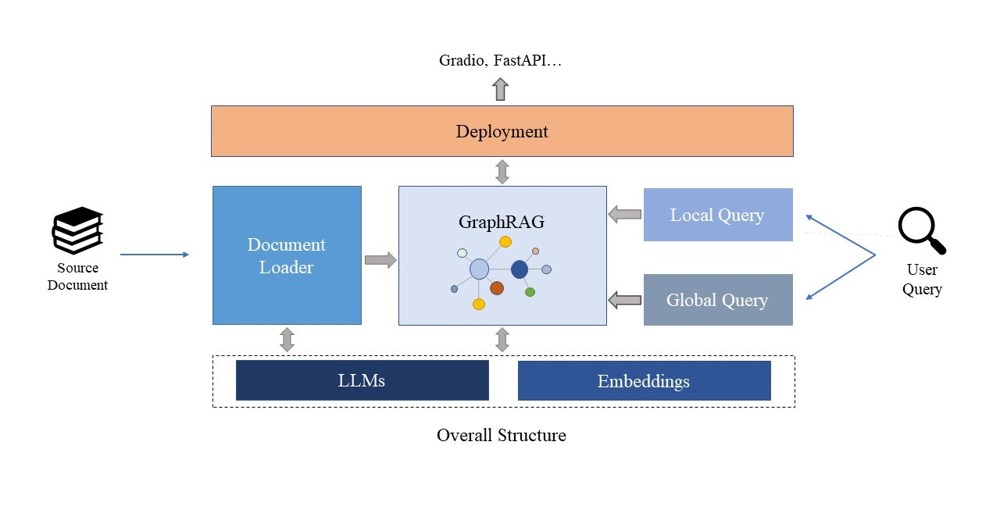
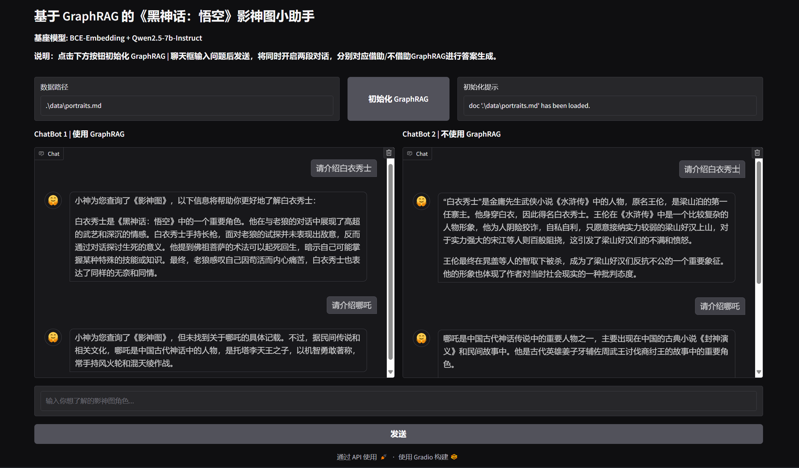

# Chat-BlackMyth

Chat-BlackMyth 是依托《黑神话：悟空》影神图故事设计的聊天机器人，基于 GraphRAG 实现相关语料的检索增强生成。

[《黑神话：悟空》](https://www.heishenhua.com/)是由[游戏科学](https://www.gamesci.com.cn/)开发和发行的动作角色扮演（ARPG）游戏，
是我国真正意义上的首款“3A游戏”，具有划时代的意义。

[影神图](https://wiki.biligame.com/wukong/%E5%BD%B1%E7%A5%9E%E5%9B%BE)是《黑神话：悟空》内置的角色图鉴，
记录了玩家游玩途中所遇人物和敌人的名字、画像、生平轶事。包涵 90 只小妖、55 只头目、26 只妖王、32 位人物。
头目、妖王数目总计 81 只，暗合西游记九九八十一难。

> *有好事者，将天命人沿途所遇的精怪人物，画影图形，抄名访姓，连同生平轶事，一起誊录在了一本游记之中。*

- 【2024.11.22】：🎉 《黑神话：悟空》获得 2024 金摇杆奖终极年度游戏大奖！
- 【2024.11.19】：🎉 《黑神话：悟空》获得 TGA 2024 年度游戏等四项提名！

项目中 GraphRAG 部分参考自 [tiny-graphrag](https://github.com/limafang/tiny-graphrag)，本校学长做的一个入门 GraphRAG 的宝藏仓库，欢迎各位前去点点 star！

## 整体架构



## 效果展示



## 使用方法

### Step 1： 环境准备

1.1 平台要求

- 操作系统：Windows、Linux
- 有足够显存（> 15GB），能够安装并加载对应的模型（bce-embedding-base-v1 + qwen2.5-7b-instruct）

1.2 python 环境

- `python>=3.8`
- `pytorch>=2.4.1`

```bash
# 创建 conda 环境
conda create -n chat-bm python==3.8
conda activate chat-bm
# 安装依赖
pip install -r requirements.txt
```

1.3 neo4j 依赖

需要以下版本的 Neo4j 和 JDK，以及 GDS 插件：

- Neo4j: 5.24.0
- OpenJDK: 17.0.12
- GDS: 2.10.1

1.4 .env 环境配置

项目中已包含 `.env.example` 文件，根据文件内容配置后，删除后缀即可使用。

初次使用只需配置 `ZHIPU_API_KEY` 和 Neo4j 相关内容即可正常使用， LLM 和 EMB 部分的配置会在随后介绍。

### Step 2：数据准备

以 windows 系统为例，根目录下，执行如下指令
```
cd download_data

python get_data_from_url.py
```
`get_data_from_url.py` 默认在根目录下创建 `./data/portraits.md`，并在该文件中写入影神图故事，可以根据自身需求进行修改。

数据来源：[游民星空](https://www.gamersky.com/handbook/202408/1803395.shtml)，数据准备部分参考：[black-myth-wukong-portraits](https://github.com/opsbear2/black-myth-wukong-portraits)。

### Step 3: 启动运行

项目提供两个 demo 文件：`graphdemo.py`、`webdemo.py`，供读者进行体验。

- 运行 `graphdemo.py`，建立一个简单可复用的 GraphRAG，在命令行进行体验。

注意，直接使用影神图故事构建 GraphRAG 将会耗费较长时间（大约五小时），推荐使用规模较小的文本进行体验。

构建 GraphRAG 过程中，会在根目录下生成 `workspace` 文件夹，包含 `community`、`chunk` 和 `doc` 信息：

```bash
python -i graphdemo.py
>>> query_for_example = "请介绍五行战车"
>>> # experience no graph generation  
>>> no_graph_res = llm.predict(query_for_example)
>>>
>>> # experience graphrag local query
>>> local_res = graph.local_query(query_for_example)
>>>
>>> # experience graphrag global query    
>>> global_res = graph.global_query(query_for_example)
>>> 
```

- 运行 `webdemo.py`，在网页中体验 GraphRAG

`webdemo.py` 使用 Gradio 搭建前端对话页面，方便快捷，支持从前端交互式创建 GraphRAG；

同时，页面集成了两个 ChatBot， 便于直接对比挂接 GraphRAG 大模型与未挂接 GraphRAG 大模型之间的性能差异。

```bash
python webdemo.py
```

程序默认在本地的 7860 端口上启动一个 web 服务，通过 `http://localhost:7860` 查看网站。

你可以在聊天框中同时对两个 ChatBot 发起对话。

> 注：网页 demo 中挂接 GraphRAG 的 ChatBot 目前只支持使用 local query 进行质询，由于社区数量过大，
> GraphRAG 在 global query 中针对社区相似度的打分环节会耗费大量的时间，而且从目前的实践看，global query 并未表现出较好的性能。
> 会将这一问题的针对性改进加入后续的计划中。

### Step 4: 基座选择（可选）

- 使用智谱 api

程序默认使用智谱 api 调用 embedding 模型和 llm，只需在 `.env` 文件中做好配置即可。

- 使用本地模型

由于 API 的稳定性较差，不利于 Graph RAG 中实体/三元组关系提取等长时间且高请求量的任务，项目提供一种选择，在远程开发环境中部署模型。

项目需要使用 Neo4j 图数据库进行知识图谱的持久化部署，该部分需要建立远程开发环境与本地的连接，有多种方案，下面介绍本项目采用的一种较为简单的方案： 
使用 FastAPI 部署嵌入模型和语言模型，使用 ssh 将远程端口映射到本地实现较稳定调用，提供一个[教程](https://blog.wowcmk.cn/2024/11/02/port-mapping/)。

该方法需要在 `.env` 文件中配置 `EMB_URL` 和 `LLM_URL`，其值分别为两个模型映射到本地监听端口的 url。

模型选择：bce-embedding-base-v1 + qwen2.5-7b-instruct；FastAPI 部署部分参考：[self-llm](https://github.com/datawhalechina/self-llm/blob/master/models/Qwen2.5-Coder/01-Qwen2.5-Coder-7B-Instruct%20FastApi%20%E9%83%A8%E7%BD%B2%E8%B0%83%E7%94%A8.md)。

## 项目结构

- `download_data`: 影神图故事数据准备
- `graphrag`: GraphRAG 相关代码
- `fastapi`: 使用 FastAPI 部署嵌入模型与语言模型
- `graphdemo.py`: Chat-BlackMyth 命令行 demo
- `webdemo.py`: Chat-BlackMyth 网页 demo
- `.env.example`: .env 文件示例
- `README.md`: 项目说明文档

## 贡献指南

欢迎各位大佬进行改进和贡献！您可以通过以下方式参与:

- 提交 Issue 反馈问题或建议新功能
- 提交 Pull Request 改进代码或文档
- 分享项目，让更多人参与和受益

## 路线图

- [x] 完成影神图数据的收集
- [x] 根据数据集构建 GraphRAG
- [x] 接入本地语言模型，构造 prompt template，完成一次成功对话
- [x] 基于 gradio 框架，完成前端对话页面构建
- [ ] 优化 GraphRAG 的 global query 功能，提高执行效率与对话表现
- [ ] 西游相关语料收集，微调本地模型并部署服务
- [ ] 支持更多 LLM 模型接口
- [ ] 加入 Agent 功能，允许通过谷歌搜索等 api 从外部获取游戏知识（比如攻略）

## 致谢

感谢以下优秀项目为本项目的顺利开展提供的宝贵指导与支持！

[1] [TinyGraphRAG](https://github.com/limafang/tiny-graphrag)

[2] [天机：人情世故大模型](https://github.com/SocialAI-tianji/Tianji)

[3] [self-llm: 开源大模型食用指南](https://github.com/datawhalechina/self-llm/tree/master)

[4] [影神图资料站](https://github.com/opsbear2/black-myth-wukong-portraits)

感谢以下优秀项目为本项目 README 文件编写提供的宝贵参考！

[1] [SwanDoc-Chat](https://github.com/little1d/SwanDoc-Chat/tree/main)

[2] [TinyGraphRAG](https://github.com/limafang/tiny-graphrag)

欢迎同学们前去点一个 star！向这些优秀而慷慨的开源工作者致敬！